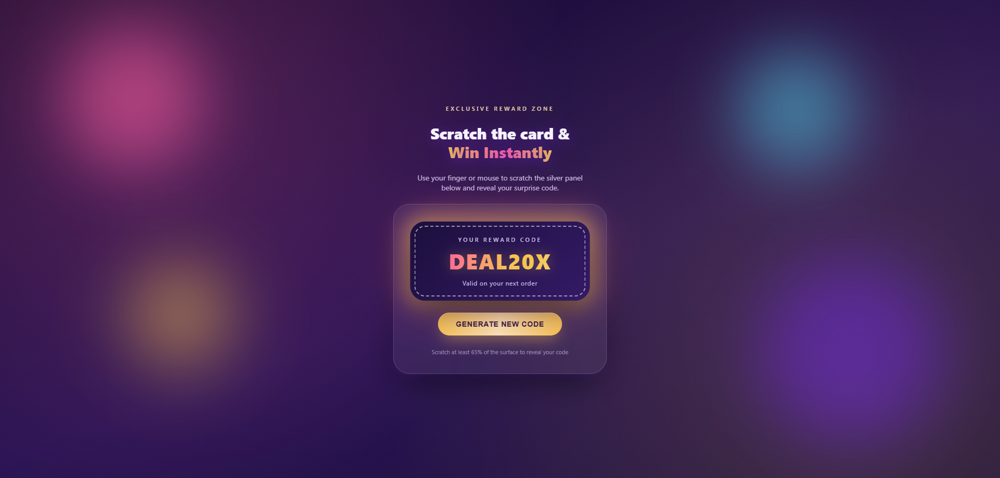

# 🎉 Premium Scratch & Win Card

[](https://github.com/Darshittank/Scratch-Card-and-Win/stargazers)
[](https://github.com/Darshittank/Scratch-Card-and-Win/network)
[](https://github.com/Darshittank/Scratch-Card-and-Win/issues)
[](https://opensource.org/licenses/MIT)
[](https://darshittank.github.io/Scratch-Card-and-Win)

## 🎯 **Live Demo**
👉 **[Live Demo!](https://darshittank.github.io/Scratch-Card-and-Win)** 👈

## 📖 **About Premium Scratch & Win Card**

**Premium Scratch & Win Card**
A modern Scratch & Win web application built using HTML5 Canvas, CSS, JavaScript, and jQuery. Scratch the metallic surface to reveal a randomly generated coupon code, then celebrate with colorful confetti cannons, floating sparkles, glowing reward animations, and optional sound effects—all contained in a single HTML file.

### 🎯 **Key Features**

🎟️ Realistic scratch card effect using HTML5 Canvas
🎲 Random coupon/code generation
🎉 Dual confetti cannon animation from both bottom corners
✨ Floating sparkle effects after revealing the code
💡 Animated glowing coupon code
🔊 Optional celebration sound (easy to enable or disable)
📱 Responsive design for desktop, tablet, and mobile
🎨 Premium glassmorphism-inspired UI
🔄 "Generate New Code" button to reset the experience
⚡ Smooth animations and optimized performance
📄 Single-file implementation (HTML, CSS, and JavaScript)

## 📸 Preview



## ⚙️ **Customization**

You can easily customize: 
&oast; Coupon code format 
&oast; Scratch reveal percentage
&oast; Confetti colors and particle count
&oast; Background gradients
&oast; Card dimensions
&oast; Glow animation
&oast; Sparkle effects
&oast; Celebration sound
&oast; Fonts and styling

## 📱 Browser Support
✅ Google Chrome
✅ Safari
✅ Mozilla Firefox
✅ Mobile Browsers
✅ Microsoft Edge

## 🛠️ **Technologies Used**

**HTML5** – Structure & Canvas API
**CSS3** – Glassmorphism, animations & responsive design
**JavaScript (ES6+)** – Scratch logic & interactivity
**jQuery** – DOM manipulation & event handling
**HTML5 Canvas API** – Scratch-to-reveal effect
**RequestAnimationFrame** – Smooth confetti & particle animations
**CSS Keyframes** – Glow, sparkles & transitions
**Touch & Mouse Events** – Cross-device support

   

## 🙌 Author

**Darshit**

⭐ Show Your Support

If you like this project, please give it a ⭐ on GitHub! It helps others discover it too.

Made with ❤️ and lots of Scratch Card & Win!

````markdown
## 🚀 Getting Started

### Clone the Repository

```bash
git clone https://github.com/Darshittank/Scratch-Card-and-Win.git
```

### Navigate to the Project

```bash
cd Scratch-Card-and-Win
```

### Run the Project

Simply open the `index.html` file in your favorite web browser.

Or use a local server for the best experience.

## 🌐 Live Demo

Try it here:

**https://darshittank.github.io/Scratch-Card-and-Win/**

## 📦 Repository

**GitHub:** https://github.com/Darshittank/Scratch-Card-and-Win
````
